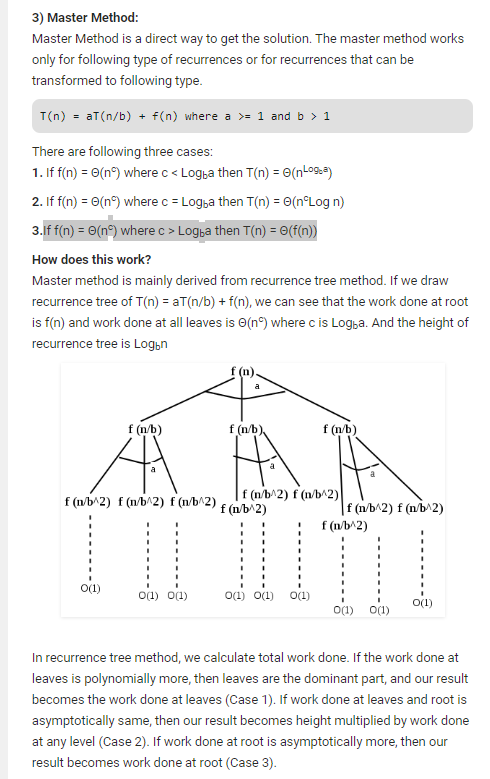

Asymptotic Analysis is the big idea that handles above issues in analyzing algorithms. In Asymptotic Analysis, we evaluate the performance of an algorithm in terms of input size (we don’t measure the actual running time). We calculate, how the time (or space) taken by an algorithm increases with the input size.

- We can have 3 cases to analyze an algorithm
  - Worst Case (usually done)
  - Average Case (sometimes done)
  - Best Case (no need to do)

### Notations

- The main idea of asymptotic analysis is to have a measure of efficient of algorithms that doesn't depend on the machine specific constants and doesn't require algorithms to be implemented and time taken by programs to be compared.

- Asymptotic notations are mathematical tools to represent time complexity of algorithms for asymptotic analysis. The following 3 asymptotic notations are mostly used to represent complexity of algorithms.

  1. theta Notation
  2. Big O natation
  3. Ohm Notation

### Upper and Lower bound

- Lower Bound –

  Let L(n) be the running time of an algorithm A(say), then g(n) is the Lower Bound of A if there exist two constants C and N such that L(n) >= C\*g(n) for n > N. Lower bound of an algorithm is shown by the asymptotic notation called Big Omega (or just Omega).

- Upper Bound –

  Let U(n) be the running time of an algorithm A(say), then g(n) is the Upper Bound of A if there exist two constants C and N such that U(n) <= C\*g(n) for n > N. Upper bound of an algorithm is shown by the asymptotic notation called Big Oh(O) (or just Oh).

### Analysis of loops

- Set of statements or function complexity (O(1))

  Time complexity of a function(or set of statements) is considered as O(1) if it doesn't contain loop, recursion and call to any other non-constant time function

  set of non-recursive and non-loop statements

- Time complexity of a loop O(n)

  Time complexity of a loop is considered as O(n) if the loop variables is incremented /decremented by a constant amount.

- Time complexity of nested loops O(n^c)

  Time complexity of nested loops is equal to the number of times innermost statement is executed.

- Time complexity of a loop is considered O(Logn) if the loop variables is divided/multiplied bya constatn number.

- Time complexity of a loop is considered as O(LogLogn) if the loop variables is reduced /increased exponentially by a constant amount.

- When there are consecutive loops, we calculate time complexity as sum of time complexities of individual loops.

### Solving Recurrence

- There are basically three methods for solving recurrences

  - Substitution Method: We make guess for the solution and then we use mathematical induction to prove the guess is correct or incorrect.

  - Recurrence Tree Method: In This method, we draw a recurrence tree and calculate the time taken by every level of tree. Finally, we sum the work done at all levels. To draw the recurrence tree, we start from the given recurrence and keep drawing till we find a pattern among levels. The pattern is typically arithmetic or geometric series.

  - Master Method

    
